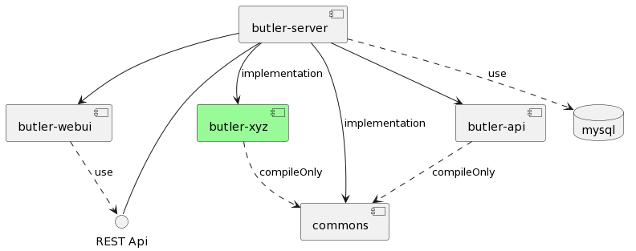
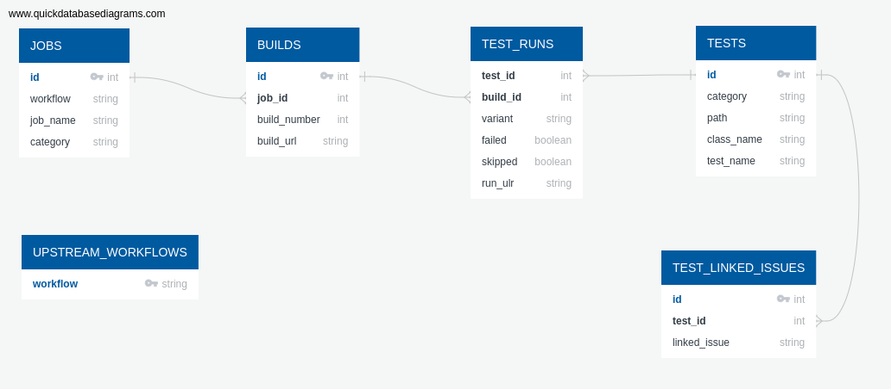

# Butler Design

## High Level Architecture

The butler sources is comprised of the following modules:

1. [`commons`](commons/): contains
  common code used by the other modules. This contain the definition of common
  objects (versions, tickets, ...) and simple clients to connect to Jenkins,
  JIRA, ...
2. [`butler-server`](butler-server/): the butler service code. Essentially a
  web server with a REST API, and that connects to MySQL for maintaining
  state.
3. [`butler-api`](butler-api/): objects used to represent the JSON inputs and
  outputs of the butler server REST API. This is separated so that those
  objects can be used both on the server, but also in the butler CLI to request
  the server (without creating a dependency on the whole server code).
4. [`butler-webui`](butler-webui/): the javacript front-end of the butler
  service. This provide the UI of the service, which feeds off the REST API.

Additional module: `butler-xyz` contains customization for project `xyz`
that can be specific for every butler deployment (by forking).

## Basic Concepts

Workflow

Project

Test Name Scheme

Issue Tracking Project

Branch(Job)

## The Stack

Butler is created as [Spring Boot](https://spring.io/projects/spring-boot) application in Java11  
with [Bootstrap Vue](https://bootstrap-vue.org/) for the UI  
and [MariaDB](https://mariadb.org/) as default database engine.

## Database Schema

Following diagram presents key concepts of butler database:

**`JOBS`** contains information about pairs `(workflow, job_name)` where `workflow` is a name of pipeline and `job_name` usually is a name of the branch.

`JOB` can have multiple **`BUILDS`** that are numbered with `build_number`. We can think about row as e.g. of build `#23` of workflow `ci` on branch `main`. Butler will keep `build_url` for the purpose of providing a link to source data.

**`TESTS`** is a test catalogue, which each test identified by
- `path` e.g. a package `com.example.project`
- `test_class` usually a name of the suite e.g. `SomeClassTest`
- and a `test_name` usually a method

**`TEST_RUNS`** keeps information about results of particular `TESTS` run possibly with different `variant` in given `BUILD`.

When data is imported then usually:
1. a row in `JOBS` already exists (or is created)
2. new row in `BUILDS` is created
3. multiple rows in `TEST_RUNS` are created for each result of a test run in a specific variant
4. rows in `TESTS` are created iff they did not yet exist e.g. if there is new test added in the imported build

`UPSTREAM_WORKFLOWS` is a configuration table used to tell butler which `workflows` are to be presented in the UI and monitored.

See [schema.sql](../butler/butler-server/src/main/resources/db/schema.sql) for full schema.
