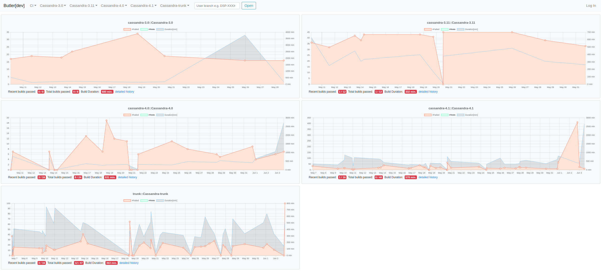
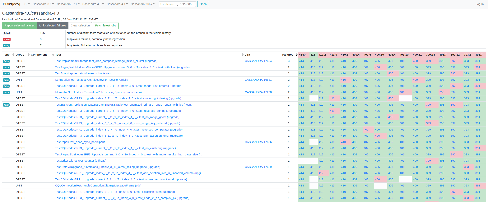

# Butler

> Note: this is an unsupported open source project created by DataStax employees

Inspiration for butler was to cope with flickering tests in [Datastax Enterprise](https://www.datastax.com/products/datastax-enterprise) development as well as in [Apache Cassandra](https://cassandra.apache.org).

TODO: thanks to Sylvain an Jon.

## Elevator pitch

Butler aims at providing a combined test quality perspective by  
tracking test failures coming from multiple CI workflows  
potentially on multiple maintained product branches  
and creating or linking them to issue tracking tickets  
providing development teams with the means to  
judge if their commits or PR bring new test regression  
or which tests are failing or flickering so that  
they can be picked up and fixed.

## Major features

1. Importing test results from jenkins
2. Importing test results from any tools via raw import api
3. Presenting history of failures per workflow/branch
4. Presenting history of failures per test
5. Linking issue tracking tickets (jira atm) to failures
6. Creating issue tracking tickets (jira atm) by one click

Some screens from [butler apache cassandra](https://butler.cassandra.apache.org/):

## Use without customization

Without additional customization `butler` allows to use one workflow (`ci`) with one upstream branch (`main`) and data imported via rest api.

See [basic usage guidelines](doc/BASIC-USAGE.md)] for detailed instruction how to do it.

## Customization

Each software project is different so it may be required
to customize `butler` so that it understands:

- which jenkins or other CI to use
- what worklflows are defined and should be monitored
- what branches are maintained (e.g. main, master, or 1.0-dev)
- how to translate jenkins test names to unified `suite.class.test` scheme used by `butler`
- what issue tracking systems are used
- what projects are used for reporting or linking tickets
- what should be the content of the reported ticket

Customization is done by code as it is sometimes quite complex.
See [customization guidelines](CUSTOMIZATION.md) for details.

Understanding [butler entities and relations](doc/DESIGN.md) between them can be be helpful to customize data import from jenkins or other systems.

## When to use butler?

Butler is usefull mostly if:
1. product is mature and there are several branches (released versions) maintained
2. product is complex and there are different groups of tests performed in different CI systems
3. there is a tool to unify the view
4. despite flickering tests team want to have some PR merge gating based on CI test results

## When butler is not really helpful?

1. If the team does not care about the tests condition
2. If there are no test failures in the CI because zero-bug-tolerance policy is really working.

## Supported CI systems

Butler supports importing data from any [jenkins](https://www.jenkins.io/) instance, being it a multibranch or standard pipeline.

Importing data from any other source can be done by implementing
dedicated importer using dediated [raw import rest api](doc/RAW-IMPORT-API.md).

## Supported Issue tracking systems

Butler is prepared to support any issue tracking system, but only [JIRA] is fully supported atm
- it allows to create tickets with customized content
- it allows to link existing tickets
- it allows to search potentially related tickets

## Using butler

Butler provides one executable:
*the Butler service*, which provides both a REST API and a web UI using it.

Butler is using [MariaDB]() database which needs to be created and seeded with [schema.sql](butler-server/src/main/resources/db/schema.sql).

To run the Butler service, see the [`butler-server` module README](butler-server/README.md).

## License

Copyright 2021 DataStax Inc

Licensed under the Apache License, Version 2.0 (the "License");
you may not use this file except in compliance with the License.
You may obtain a copy of the License at

     http://www.apache.org/licenses/LICENSE-2.0

Unless required by applicable law or agreed to in writing, software
distributed under the License is distributed on an "AS IS" BASIS,
WITHOUT WARRANTIES OR CONDITIONS OF ANY KIND, either express or implied.
See the License for the specific language governing permissions and
limitations under the License.

