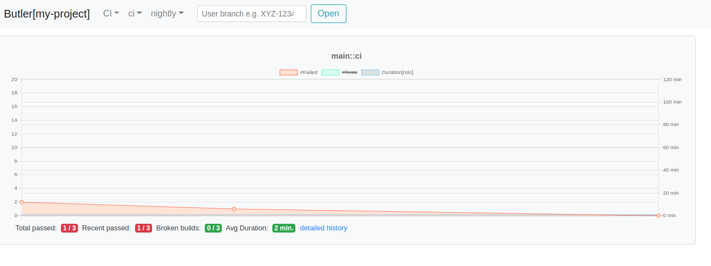

# START

This document descibes how to start using `butler`
without the need to do any code changes.

## Assume That

To run butler you will need a vm / docker / whatever
with `java11`, `npm`, `node.js` and `MariaDB`.

## Prepare Database

First you need to create user, database and populate schema

    CREATE USER butler@'%';
    CREATE DATABASE my_project CHARACTER SET utf8;
    GRANT ALL PRIVILEGES ON my_project.* to butler;
    USE my_project;
    SOURCE butler-server/src/main/resources/db/schema.sql

Then set env variables so that butler can connect

```bash
export MYSQL_HOST=localhost
export MYSQL_DB=my_project
export MYSQL_USER=butler
```

You can also edit or prepare new `application.properties` file.

## Configure JIRA Project

`Butler` without any code changes should be able to configure
and use one default jira project, so that it will be possible
to link test failures to existing tickets or even create new ones
directly from `butler` UI.

First we need to let butler that we want to use this project
by editing some properties:

```ini
butler.jira.default.project.enabled=true
butler.jira.key=XYZ  # place your project key
butler.jira.url=https://jira.example.com  # update url
```

If your jira requires authentication please edit the [.netrc](https://everything.curl.dev/usingcurl/netrc) file. Butler will pick up credentials from there.

## Configure workflows and branches

### Workflows

Butler needs to know workflows that your project
is using for CI or in general for running tests.

If there is a need for customized import from jenkins test reports then probably a fork and some code addition
would be the best approach...

... but in some simple case it is ok to use [raw build import](doc/REST-API.md)
functionality and just tell butler the names of the workflows
by putting them into the `UPSTREAM_WORKFLOWS` table:

```sql
INSERT INTO upstream_workflows(workflow) VALUES('ci');
INSERT INTO upstream_workflows(workflow) VALUES('nightly');
```

After application restart workflows: `ci` and `nightly` will automatically appear in the butler UI menu.

### Branches

By default butler uses `main` branch as the only upstream (maintained) branch for workflows registered in the previous step.

You can change it or add more branches by editing db table `MAINTAINED_VERSIONS` e.g. by

```sql
INSERT INTO workflow_branches(workflow, branch) VALUES('ci', 'main');
INSERT INTO workflow_branches(workflow, branch) VALUES('ci', '1.0-dev');
INSERT INTO workflow_branches(workflow, branch) VALUES('nightly', 'main');
INSERT INTO workflow_branches(workflow, branch) VALUES('nightly', '1.0-dev');
```

Remember to configure all branches (including `main`, `master` or whatever you use) as butler will replace default `main` with the content of the database.

## start.sh

All the configuration can be done in the [bin/start.sh](bin/start.sh) file that can be customized to change many of the configuration settings we have discussed above.

## Import test results

Importing data can be done via the raw build import,
which does not assume anything about the project-specific code
and allows to just import plain data organized in 
the `json` file containting:
- some metadata about the build and 
- a list of test results

Example content:
```json
{
  "workflow": "ci",
  "branch": "main",
  "build_number": 1,
  "url": "http://ci.example.com/ci/main/1",
  "start_time": 1651215600,
  "duration_ms": 100013,
  "tests": [
    {
      "test_suite": "com.example.Suite1",
      "test_case": "testA",
      "variant": "",
      "failed": false,
      "skipped": false,
      "duration_ms": 1000,
      "url": "http://ci.example.com/ci/main/1/com.example.Suite1/testA"
    },
    {
      "test_suite": "com.example.Suite1",
      "test_case": "testB",
      "variant": "variant1",
      "failed": false,
      "skipped": false,
      "duration_ms": 2000,
      "url": "http://ci.example.com/ci/main/1/com.example.Suite1/testB-variant1"
    }
  ]
}
```

### Examaple data

Test data can be used to get some working dataset in butler
(use `curl` or [httpie](https://httpie.io/) or whatever you like):

```bash
http POST http://localhost:8080/api/ci/builds/import/raw < ./butler-server/src/integrationTest/resources/build-ci-main-1.json --body
{
    "build_number": 1,
    "job_name": "main",
    "workflow": "ci"
}

http POST http://localhost:8080/api/ci/builds/import/raw < ./butler-server/src/integrationTest/resources/build-ci-main-2.json --body
{
    "build_number": 2,
    "job_name": "main",
    "workflow": "ci"
}

http POST http://localhost:8080/api/ci/builds/import/raw < ./butler-server/src/integrationTest/resources/build-ci-main-3.json --body
{
    "build_number": 3,
    "job_name": "main",
    "workflow": "ci"
}
```

Final result will look like this:



ENJOY!